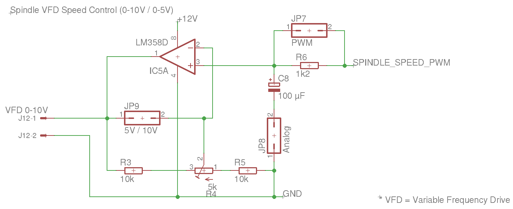
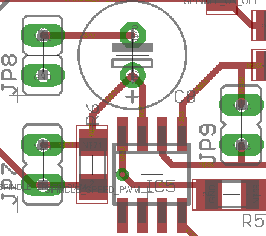
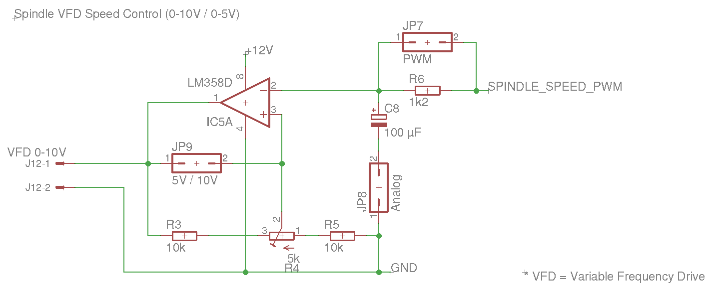
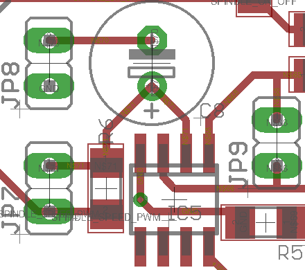

# MPCNC Mega 2560 Pro Shield Changelog

## v1.2 Rev.4 - 2023-12-01

💥 Pins 3 and 4 of IC were swapped which lead to non functional "Spindle VFD Speed Control" part.

Thanks to [Gerssi](https://github.com/Gerssi) for reporting!

To fix this issue in already existing PCBs you may cut the two wires going to IC5 pin 2 and 3 on the PCB and use a small external wire to connect them accordingly.

**Fixed** in revision 4:

**Wrong** in revision 3:

