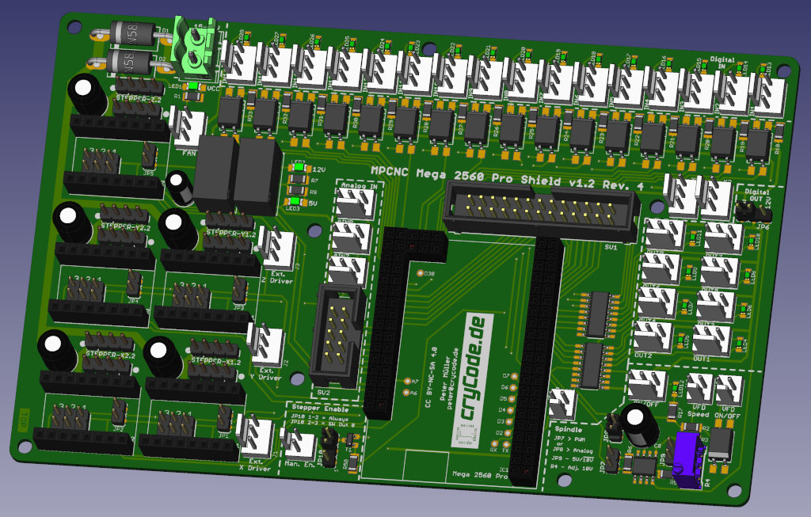

# MPCNC Mega 2560 Pro Shield

A CNC Shield for the [Mostly Printed CNC](https://www.v1engineering.com/specifications/) (MPCNC) by V1 Engineering intended to be used with Estlcam.

## License

**Creative Commons CC-BY-SA-NC 4.0 License**

Created and Copyright 2020-2023 by
* Peter Müller <peter@crycode.de>
* Günter Brauer <gbzzr1100@gmail.de>

Parts based on [MPCNC Nano Estlcam Shield](https://github.com/tnn85/MPCNC-Nano-Estlcam-Shield) by Till Nenz.
